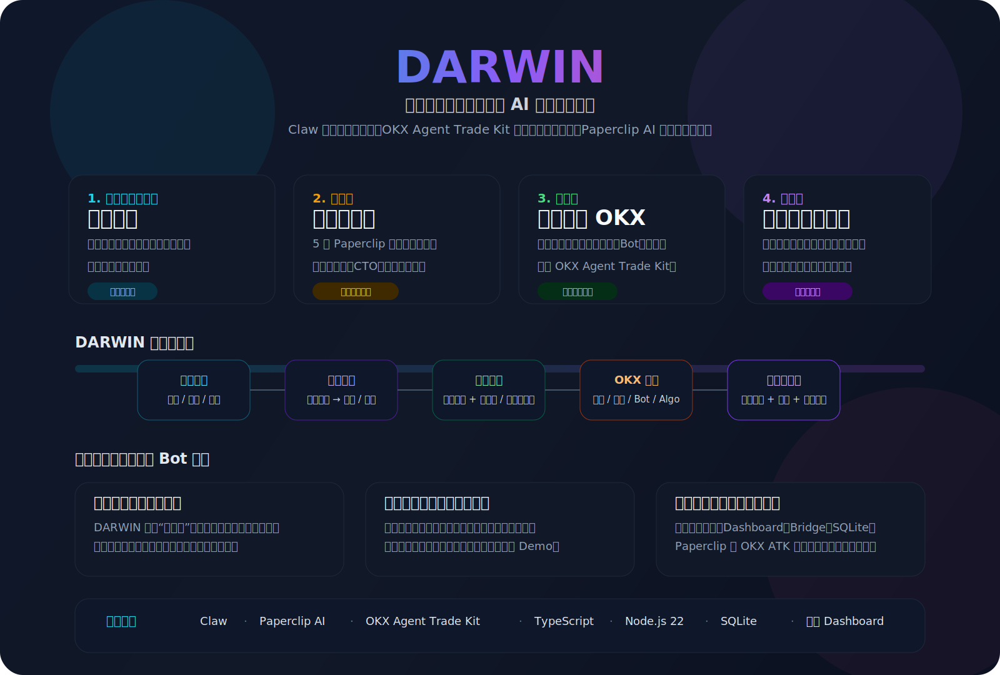
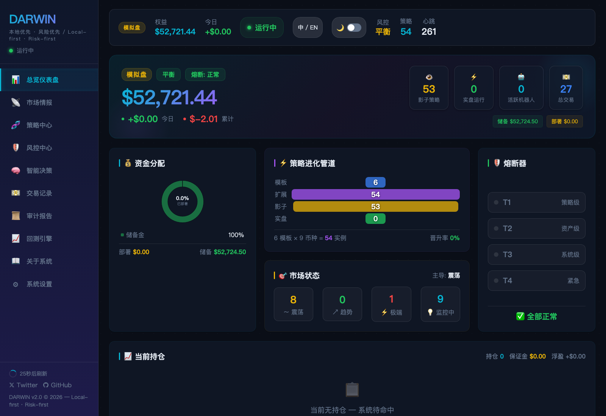
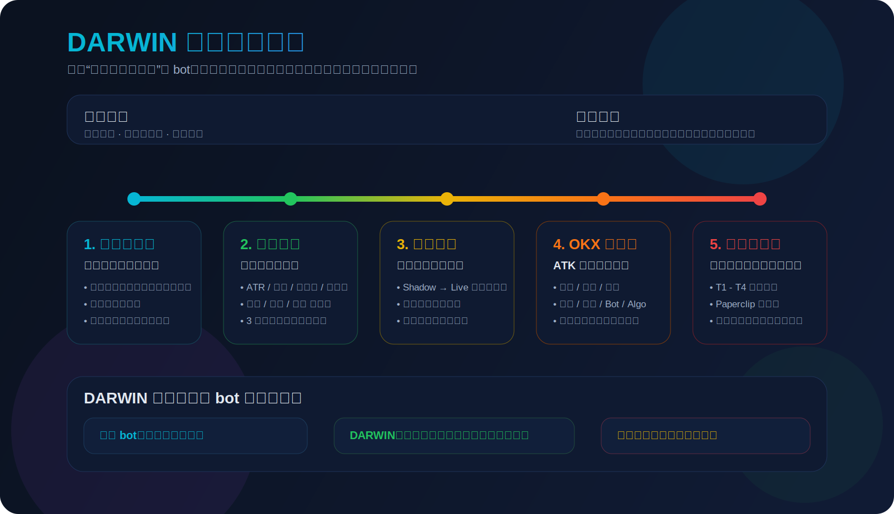
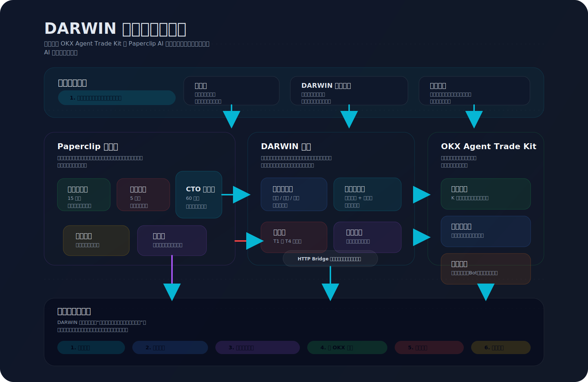
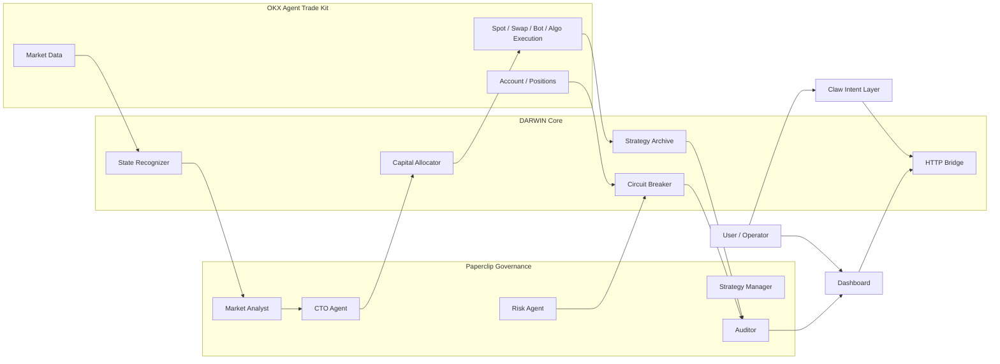

# DARWIN

**Dynamic Adaptive Risk-Weighted Intelligence Network**

> *一个本地优先、风险优先的 AI 交易治理系统*

**中文** | [English](README_EN.md)

[](https://www.okx.com/zh-hans/agent-tradekit)
[](https://github.com/paperclipai/paperclip)
[](https://www.typescriptlang.org/)
[](https://www.okx.com/zh-hans/demo-trading)

项目链接：[`Demo`](https://darwin-dashboard.onrender.com/) · [`GitHub`](https://github.com/Wxiaobai123/DARWIN) · [`X`](https://x.com/HHZ008)

---

## 系统摘要

> **DARWIN 将市场识别、策略选择、真实执行、风险控制和审计报告组织在同一条治理链上。**

---

## 快速开始

建议先看这 4 个入口：

| 入口 | 用途 |
|---|---|
| `pnpm run overview` | 本地静态系统概览，无需交易所凭证 |
| `pnpm run verify` | 在已配置 OKX Demo 凭证时，验证真实 ATK 集成链路 |
| `http://localhost:3200/dashboard?lang=cn#overview` | 在启动 bridge 后查看实时权益、市场状态、策略管道和系统健康 |
| `http://localhost:3200/dashboard?lang=en#decision` → `#risk` → `#reports` | 在启动 bridge 后查看决策依据、风险门禁和审计闭环 |

推荐本地体验路径：

```bash
pnpm install
pnpm run overview
pnpm run bridge
```

两种本地运行方式：
- `pnpm run overview`：输出本地静态系统概览，适合先理解系统结构和主链路。
- `pnpm run verify`：需要配置 OKX Demo 凭证，用来验证真实 OKX Agent Trade Kit 执行链路。

---

## 系统特征

| 设计维度 | DARWIN |
|---|---|
| 市场适配 | 根据市场状态切换策略簇 |
| 运行闭环 | 执行、风控、熔断、报告在同一条决策轨道上 |
| 风险控制 | 4 层熔断 + 审批门禁 |
| 运行留痕 | 自动生成日报和审计记录 |

---

## OKX Agent Trade Kit 集成

DARWIN 以 **OKX Agent Trade Kit** 作为交易能力层，用于市场读取、账户约束、执行落地和算法单编排：

| ATK 能力层 | DARWIN 里怎么体现 |
|---|---|
| `market` | ATR、资金费率、成交量、多空比、市场状态识别 |
| `account` | 权益、仓位、保证金、资金部署和风险快照 |
| `execution` | 现货、合约、Trailing Stop、真实开平仓链路 |
| `bot / algo` | Spot Grid、Contract Grid、Martingale、Funding Arb、TWAP、Iceberg |

没有 ATK，DARWIN 就无法同时完成市场感知、账户约束、执行落地和策略机器人编排。

---

## DARWIN 是什么？

DARWIN 是一个**本地优先、风险优先的 AI 交易治理系统**：负责读取市场、识别状态、选择策略，通过 OKX 执行交易，并把风控、熔断和报告保持在同一条决策轨道上。

两大基础能力：
- **[OKX Agent Trade Kit](https://www.okx.com/zh-hans/agent-tradekit)** — MCP + CLI tooling covering the full trading lifecycle across market, account, spot, swap, bot, and related execution modules
- **[Paperclip AI](https://github.com/paperclipai/paperclip)** — open-source multi-agent orchestration platform with org hierarchy, heartbeat scheduling, budget control, and human approval gates

**用户设置风险偏好和币种白名单；DARWIN 负责市场识别、策略治理、执行协同和风险控制。**

项目文档：
- [Intent Pipeline](docs/INTENT_PIPELINE.md)
- [Product Positioning](docs/PRODUCT_POSITIONING.md)
- [System Navigation](docs/SYSTEM_NAVIGATION.md)
- [Project Architecture](docs/PROJECT_ARCHITECTURE.md)
- [Full System Architecture](docs/ARCHITECTURE.md)
- [Strategy Specification](docs/STRATEGY_SPEC.md)

---

## 系统总览



---

## 界面预览

中文总览：



英文 About 页：


---

## 设计重点

- **把交易从“会下单”提升到“会治理”**：DARWIN 不只执行命令，还会根据市场状态切换策略、限制风险暴露，并留下完整审计链路。
- **把分散的交易动作串成一条责任链**：市场识别、策略分配、真实执行、熔断保护、日报回顾都在同一条决策轨道上。
- **把 OKX Agent Trade Kit 纳入统一运行链路**：市场数据、账户状态、执行能力和策略机器人都在同一套治理模型内运行。



---

## 架构总览





更完整的分层说明见 [Project Architecture](docs/PROJECT_ARCHITECTURE.md)。

---

## 系统架构

```
╔══════════════════════════════════════════════════════════════╗
║  USER LAYER                                                  ║
║  风控等级 · 币种白名单 · 审批熔断器重置 · 每日报告          ║
╚════════════════════════════╤═════════════════════════════════╝
                             │ Approval gates (Paperclip UI)
╔════════════════════════════▼═════════════════════════════════╗
║  PAPERCLIP AGENT ORG  (http://127.0.0.1:3100)               ║
║  ┌─────────────┐  ┌──────────────┐  ┌──────────────────┐   ║
║  │  CTO Agent  │  │ 市场分析师   │  │   风控代理       │   ║
║  │  (1h tick)  │  │ (15min tick) │  │   (5min tick)    │   ║
║  │             │  │              │  │                  │   ║
║  │ 状态切换    │  │ ATR/资金费率 │  │  四级熔断器      │   ║
║  │ 资金再平衡  │  │ 成交量/多空比│  │  Paperclip 审批  │   ║
║  └──────┬──────┘  └──────┬───────┘  └───────┬──────────┘   ║
║  ┌──────▼──────────────────▼─────────────────▼──────────┐   ║
║  │  策略管理器 (daily) · 审计员 (daily)                 │   ║
║  │  晋升/降级/淘汰 · 每日报告                          │   ║
║  └──────────────────────────────────────────────────────┘   ║
╚════════════════════════════╤═════════════════════════════════╝
                             │ HTTP heartbeat calls (POST)
╔════════════════════════════▼═════════════════════════════════╗
║  DARWIN HTTP BRIDGE  (http://127.0.0.1:3200)                ║
║  POST /heartbeat/{market|risk|cto|strategy-manager|auditor} ║
║  POST /approval/{tier3-reset|tier4-reset}                   ║
║  GET  /status                                               ║
╚═══════════┬═══════════════╤═══════════════════╤═════════════╝
            │               │                   │
╔═══════════▼════╗  ╔════════▼════════╗  ╔══════▼════════════╗
║ 市场情报       ║  ║  风险引擎      ║  ║  策略档案        ║
║ 震荡/趋势/极端 ║  ║ 4级熔断器      ║  ║  6策略 × N币种   ║
║ 3次确认缓冲    ║  ║ T1 策略级      ║  ║  影子 → 实盘     ║
║                ║  ║ T2 资产级      ║  ║  加权评分分配器  ║
║ ATR · 资金费率 ║  ║ T3 组合级      ║  ║  Score = WR×0.4  ║
║ 成交量 · 多空  ║  ║ T4 紧急级      ║  ║       + SR×0.3   ║
╚═══════════╤════╝  ║ Paperclip 审批 ║  ║       + fit×0.2  ║
            │       ╚════════════════╝  ║       + stab×0.1 ║
            │                           ╚══════╤═══════════╝
╔═══════════▼══════════════════════════════════▼════════════╗
║  OKX AGENT TRADE KIT  (demo account)                      ║
║  现货网格 · 合约网格 · 马丁格尔 · 趋势追踪 · 资金费率套利 ║
║  极端防守 · TWAP · 冰山策略 · 现货 · 合约                 ║
║  OKX ATK MCP + CLI · Full Trading Lifecycle               ║
╚═══════════════════════════════════════════════════════════╝
```

---

## 核心能力

### 1. Market Regime Detection with Confirmation Buffer
Before any strategy executes, DARWIN classifies the market using 4 indicators:

| State | ATR | Funding Rate | Volume | L/S Ratio |
|-------|-----|-------------|--------|-----------|
| **震荡 (Oscillation)** | < 1.2× avg | Near 0% | Normal | Balanced |
| **趋势 (Trend)** | > 1.5× avg | Directional | Elevated | Skewed |
| **极端 (Extreme)** | > 2.5× avg | Extreme | Very high | Panic |

**3-confirmation buffer** prevents false regime switches: a state must persist for 3 consecutive heartbeats (45 minutes) before DARWIN acts on it.

### 2. Paperclip Agent Org — Human-in-the-Loop at Scale

DARWIN is registered as a **Paperclip company** with 5 agents in a proper org hierarchy:

```
CTO Agent (Chief Trading Officer)  ← root, no manager
├── Market Analyst  (15min)       ← feeds market state to CTO
├── Risk Agent      (5min)        ← circuit breaker, T3/T4 → Paperclip approval
├── Strategy Manager (daily)      ← promote/demote lifecycle
└── Auditor         (daily)       ← immutable audit trail + report
```

### 3. Four-Tier Circuit Breaker with Paperclip Approval Gate

```
Tier 1  策略回撤超限           → 暂停该策略      → 次日自动恢复
Tier 2  资产回撤超限 × 0.5     → 暂停该资产策略  → 风控+CTO审核
Tier 3  组合回撤超限           → 停止所有策略    → 需 Paperclip 审批 ✓
Tier 4  日亏超限×2 或 API断连  → 紧急全面停止    → 需手动重启 ✓

执行门控: 熔断器激活后，新交易入场被阻止，已阻断策略被强制平仓。
```

### 4. Shadow-First Strategy Lifecycle

Every strategy must prove itself in demo mode before receiving real capital:

```
YAML spec submitted
  → Static validation (market states, tools whitelist, risk params)
  → Shadow bot created in OKX demo account
  → Performance tracked per heartbeat (win rate, drawdown, returns)
  → Promotion criteria evaluated (tool-aware thresholds):
      Grid: min 3 days, 3 trades · DCA: 3 days, 3 trades · Swap: 3 days, 1 trade
  → Promoted to "live" (capital allocated by weighted scoring)
  → Demoted if live drawdown exceeds trigger
  → Eliminated after 3 failed shadow attempts
```

### 5. Coin-Agnostic Strategy Templates

Strategies use wildcard `["*"]` for assets — automatically expanded to the user's whitelist:

```yaml
# Strategy YAML
conditions:
  assets: ["*"]    # ← expands to user's ASSETS from .env

# .env
ASSETS=BTC-USDT,ETH-USDT,SOL-USDT,DOGE-USDT,XRP-USDT,TRX-USDT,HYPE-USDT,OKB-USDT,XAUT-USDT
```

Result: `现货网格` template → 9 independent instances:
`现货网格 · BTC`, `现货网格 · ETH`, `现货网格 · SOL`, `现货网格 · TRX`, etc.

AI decides which coins to activate based on market conditions.

### 6. Weighted Scoring Capital Allocation

```
Strategy Score = WinRate × 0.4
               + SharpeProxy × 0.3
               + StateMatch × 0.2
               + Stability × 0.1

Allocation = DeployablePool × (Score / TotalScore)
```

Hard caps by risk tier:

| Tier | Active Pool | Single Strategy Cap | New Strategy Cap |
|------|------------|--------------------|--------------------|
| Conservative | 30% of equity | 20% of pool | 8% of pool |
| Balanced | 50% of equity | 30% of pool | 10% of pool |
| Aggressive | 70% of equity | 40% of pool | 15% of pool |

**Extreme state override:** max 5% deployed regardless of tier.

---

## 六大内置策略 × N 币种

| # | Strategy | Tool | Market State | Description |
|---|----------|------|-------------|-------------|
| 001 | 现货网格 | `okx_grid_bot` | 震荡 | 现货网格低买高卖，自动捕获价格波动 |
| 002 | 合约马丁格尔 | `okx_dca_bot` | 震荡 | 5x杠杆DCA，下跌加仓摊平成本 |
| 003 | 极端行情防守哨兵 | `okx_spot_order` | 极端 | 纯监控模式，保护资金安全 |
| 004 | 合约网格 | `okx_contract_grid` | 震荡 | 5x杠杆双向网格，放大波动收益 |
| 005 | 趋势追踪 | `okx_swap_trailing_stop` | 趋势 | MACD信号开仓，3%移动止盈 |
| 007 | 资金费率套利 | `okx_funding_arb` | 震荡+趋势 | Delta中性，持续收取资金费率 |

每个策略自动展开为 N 个币种实例 (默认 9 币种 = 54 个策略实例)。

> 💡 HYPE-USDT-SWAP 和 OKB-USDT-SWAP 在 OKX 暂不存在，相关合约策略会自动跳过。

**Additional execution engines (code complete):**
- `okx_twap` — TWAP 时间加权拆单
- `okx_iceberg` — 冰山策略隐藏大单

---

## 快速开始

### Prerequisites
- Node.js 22+ with `pnpm`
- OKX API key (demo mode recommended)
- Paperclip AI installed: `npm install -g paperclipai`

### 1. Install & Configure

```bash
git clone <repo>
cd DARWIN
pnpm install

# Copy and edit environment
cp .env.example .env
# Set OKX_API_KEY, OKX_SECRET_KEY, OKX_PASSPHRASE
# Set OKX_DEMO_MODE=true for safe testing
# Customize ASSETS to choose your coin whitelist
```

### 2. Start Paperclip (Agent Org Platform)

```bash
pnpm run paperclip
# → Paperclip UI available at http://localhost:3100
# → DARWIN company and 5 agents already configured
```

### 3. Start DARWIN

```bash
pnpm start
# → Loads 6 official strategies, expands to 54 instances
# → Starts Paperclip HTTP bridge on :3200
# → Runs initial market scan for all configured assets
# → Sets up recurring heartbeats (market/risk/CTO/strategy/audit)
```

### 4. Watch it run

```
  ██████╗  █████╗ ██████╗ ██╗    ██╗██╗███╗   ██╗
  ██╔══██╗██╔══██╗██╔══██╗██║    ██║██║████╗  ██║
  ██║  ██║███████║██████╔╝██║ █╗ ██║██║██╔██╗ ██║
  ...

  模式       DEMO ✓
  风控等级   BALANCED
  监控币种   BTC-USDT  ETH-USDT  SOL-USDT  DOGE-USDT  XRP-USDT  TRX-USDT  HYPE-USDT  OKB-USDT  XAUT-USDT
  心跳间隔   15 分钟

  ✓ Paperclip 桥接服务就绪  → http://127.0.0.1:3200

  BTC-USDT      〰  震荡         [████████░░░░]  81%
                   波动率 0.87x  资金费率 +0.0042%  成交量 1.13x  多空比 1.02

  ETH-USDT      〰  震荡         [██████░░░░░░]  68%
                   波动率 0.91x  资金费率 +0.0031%  成交量 1.08x  多空比 0.98

  SOL-USDT      〰  震荡         [██████░░░░░░]  49%
  DOGE-USDT     〰  震荡         [███████░░░░░]  56%
  XRP-USDT      〰  震荡         [████████░░░░]  63%
  TRX-USDT      〰  震荡         [████████░░░░]  63%

  策略列表
  ┌──────────────────────────┬──────────┬──────────┬──────────────────┐
  │ 策略名称                  │ 类型      │ 状态     │ 机器人ID          │
  ├──────────────────────────┼──────────┼──────────┼──────────────────┤
  │ 现货网格 · BTC             │ 现货网格   │ 影子测试  │ …226132901888    │
  │ 现货网格 · ETH             │ 现货网格   │ 影子测试  │ …263512535040    │
  │ 合约马丁格尔 · BTC          │ 马丁格尔   │ 影子测试  │ ────────────     │
  └──────────────────────────┴──────────┴──────────┴──────────────────┘

  🛡  风控代理  权益 $52,270  日盈亏 +$0.00  回撤 0.00%
```

### 5. Demo Scenarios

```bash
pnpm run overview                   # 本地静态系统概览
pnpm run verify                     # 真实 OKX Demo 验证（需要凭证）
pnpm run demo:walkthrough:deterministic  # 固定夹具运行导览

pnpm run demo:a   # Scenario A: Normal operation (all modules)
pnpm run demo:b   # Scenario B: Market state transition
pnpm run demo:c   # Scenario C: Circuit breaker + Paperclip approval
```

### 6. Backtesting

```bash
pnpm run backtest          # Default 30-day backtest
pnpm run backtest:90d      # 90-day historical simulation
pnpm run backtest:180d     # 180-day historical simulation
```

### 7. Dashboard (实时控制面板)

```bash
pnpm run bridge
# → Dashboard available at http://localhost:3200
```

打开浏览器访问 `http://localhost:3200` 即可查看实时控制面板，包含：

| 页面 | 功能 |
|------|------|
| **总览仪表盘** | 权益概览、资金分配、策略管道、持仓、市场状态、系统健康 |
| **市场情报** | 白名单币种实时状态、ATR/费率/多空比指标、历史状态变化 |
| **策略中心** | 策略排行、评分分解、活跃机器人、状态热力图 |
| **风控中心** | 四层熔断器状态、持仓监控、风险事件日志 |
| **智能决策** | 5 大智能体实时协作、决策流水线、市场判断、资金分配 |
| **交易记录** | 累计盈亏、夏普比率、持仓详情、每日盈亏图表 |
| **审计报告** | AI 生成每日报告、策略分类分析、CSV 导出 |
| **回测引擎** | 3 级风控对比、权益曲线、回撤分析、市场状态时间线 |
| **关于系统** | 架构图、系统优势、模块说明、安全架构 |
| **系统设置** | 风控等级调整、熔断器手动重置、配置持久化 |

> 支持深色/浅色主题切换，完整移动端适配 (375px+)
> 支持中英文切换：右上角语言按钮，或直接访问 `http://localhost:3200/dashboard?lang=cn` / `http://localhost:3200/dashboard?lang=en`

---

## 执行引擎覆盖

DARWIN covers **8 distinct execution tools** through OKX ATK:

| Tool | Type | Description |
|------|------|-------------|
| `okx_grid_bot` | 现货网格 | Spot grid — auto buy low sell high |
| `okx_contract_grid` | 合约网格 | Contract grid — leveraged bilateral |
| `okx_dca_bot` | 马丁格尔 | DCA Martingale — cost averaging on dips |
| `okx_swap_trailing_stop` | 趋势追踪 | Swap with trailing stop — ride trends |
| `okx_spot_order` | 现货交易 | Spot market/limit orders |
| `okx_funding_arb` | 费率套利 | Spot long + swap short, delta neutral |
| `okx_twap` | 时间加权 | TWAP order splitting |
| `okx_iceberg` | 冰山策略 | Hidden volume execution |

---

## 验证

推荐的本地查看路径：

```bash
pnpm run overview
pnpm run bridge
```

Current verified result as of 2026-03-20:

- `pnpm run overview` passes
- `pnpm run verify` passes
- `pnpm test:strategies` passes with `6 passed / 0 failed / 0 skipped`

---

## 仓库结构

```
DARWIN/
├── src/
│   ├── index.ts                    # Main entry — 5 agent heartbeat loops
│   ├── config.ts                   # .env config (assets, risk tier, etc.)
│   ├── db.ts                       # SQLite (Node 22 built-in)
│   ├── market/
│   │   ├── state-recognizer.ts     # 3-state regime detection
│   │   └── indicators.ts           # ATR, RSI, MACD, Bollinger, etc.
│   ├── risk/
│   │   └── circuit-breaker.ts      # 4-tier CB + Paperclip approval
│   ├── strategy/
│   │   ├── archive.ts              # Strategy registry + leaderboard
│   │   ├── loader.ts               # YAML → DB + wildcard expansion
│   │   └── validator.ts            # 27 tools whitelisted, tool-aware thresholds
│   ├── shadow/
│   │   └── runner.ts               # Shadow bot lifecycle + dead bot recovery
│   ├── execution/
│   │   ├── manager.ts              # SL/TP/max-hold enforcement + execution gate
│   │   ├── arb-funding.ts          # Funding rate arbitrage
│   │   ├── recurring-buy.ts        # Recurring buy execution
│   │   └── twap.ts                 # TWAP + Iceberg execution
│   ├── cto/
│   │   ├── agent.ts                # CTO heartbeat + state transitions
│   │   ├── allocator.ts            # Weighted scoring capital allocation
│   │   └── llm.ts                  # Optional LLM enrichment (15 providers)
│   ├── atk/
│   │   ├── runner.ts               # Safe ATK CLI wrapper (no shell injection)
│   │   ├── bot.ts                  # Grid bot CRUD
│   │   ├── dca.ts                  # DCA/Martingale bot CRUD
│   │   ├── swap.ts                 # Perpetual swap + trailing stop
│   │   ├── spot.ts                 # Spot orders + algo TP/SL
│   │   ├── account.ts              # Portfolio equity reader
│   │   └── client.ts               # Market data client
│   ├── report/
│   │   └── generator.ts            # Daily report (Chinese)
│   ├── backtest/
│   │   └── engine.ts               # Historical simulation engine
│   ├── demo/
│   │   └── scenarios.ts            # 3 demo scenarios
│   └── paperclip/
│       ├── server.ts               # HTTP bridge (:3200)
│       └── client.ts               # Paperclip REST client
├── strategies/
│   └── official/
│       ├── 001-spot-grid.yaml           # 现货网格
│       ├── 002-contract-martingale.yaml # 合约马丁格尔
│       ├── 003-extreme-defense.yaml     # 极端行情防守哨兵
│       ├── 004-contract-grid.yaml       # 合约网格
│       ├── 005-trend-trailing.yaml      # 趋势追踪
│       └── 007-funding-arb.yaml         # 资金费率套利
├── .env.example
└── package.json
```

---

## 技术栈

| Component | Technology | Notes |
|-----------|-----------|-------|
| Agent orchestration | [Paperclip AI](https://github.com/paperclipai/paperclip) | 5 agents, org hierarchy |
| Trading platform | [OKX Agent Trade Kit](https://www.okx.com/zh-hans/agent-tradekit) | MCP + CLI covering the full trading lifecycle |
| LLM enrichment | 15 providers supported | Optional: Claude, GPT, Deepseek, Ollama, etc. |
| Bridge server | Node.js `http` (built-in) | Port 3200, DARWIN ↔ Paperclip |
| Database | SQLite (Node.js 22 built-in) | Strategy archive, performance, audit |
| Language | TypeScript 5.x | Strict mode, ESM |
| Runtime | Node.js 22+ | `--experimental-sqlite` |
| Package manager | pnpm | |

---

## 安全设计

- OKX API keys stay **local only** — never transmitted outside the machine
- ATK CLI wrapper uses **`execFileSync` with argument arrays** — zero shell injection risk
- All strategies must pass **static YAML validation** before running (27 tools whitelisted)
- Circuit breakers are **Risk Agent exclusive** — strategies cannot override
- **Tier 3/4 resets require human approval** via Paperclip
- Bridge server binds to **127.0.0.1 only** — not exposed to network
- All decisions recorded in **immutable audit trail**

---

## 产品特征总结

基于 **OKX Agent Trade Kit** 和 **Paperclip AI**。

DARWIN 的对外定位可以收敛成三点：

- **本地优先**：密钥、数据库和控制面板都留在本机，默认不把核心控制面暴露到公网。
- **风险优先**：市场识别、策略分配、真实执行、熔断保护和审计报告始终走同一条责任链。
- **治理优先**：意图处理、多智能体协同和真实交易能力都被纳入统一的运行边界与审批链。

系统当前已具备完整的产品闭环：从 OKX Demo 环境中的真实执行，到多智能体调度、策略生命周期管理、四层熔断和日报审计，全部可以在本地直接验证。

---

*DARWIN 把市场识别、策略治理、真实执行、风控熔断和审计报告放在同一条决策轨道上。*
