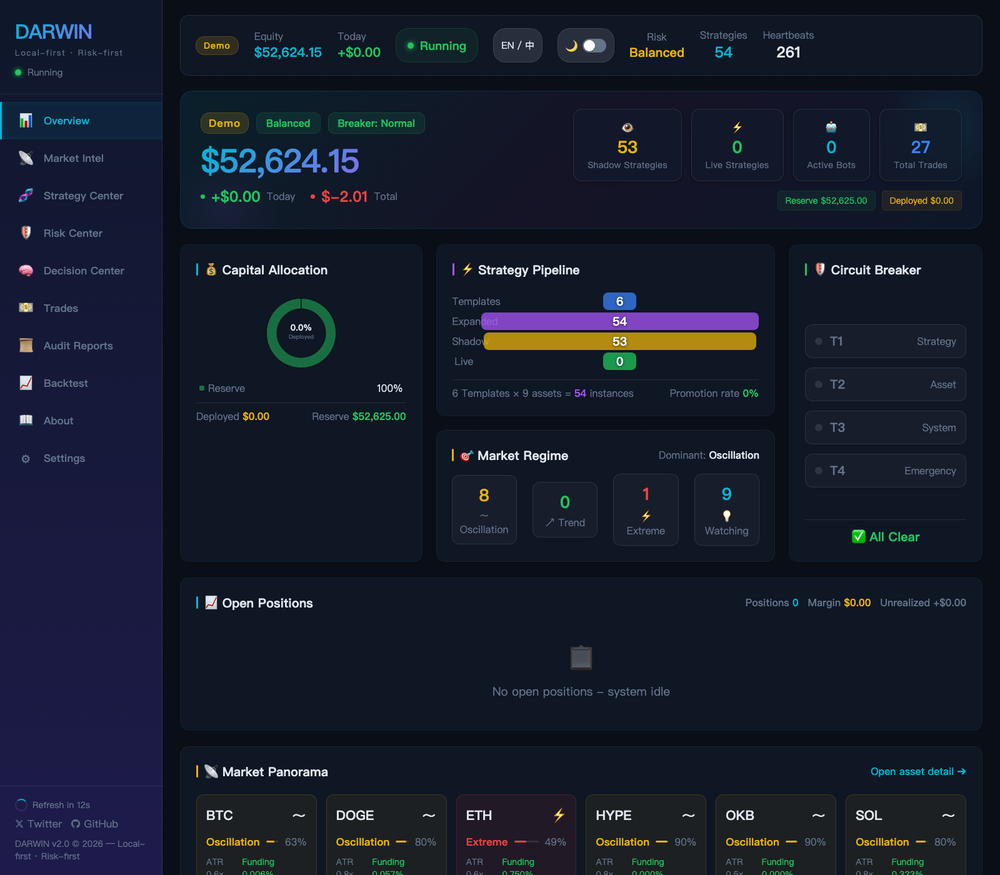
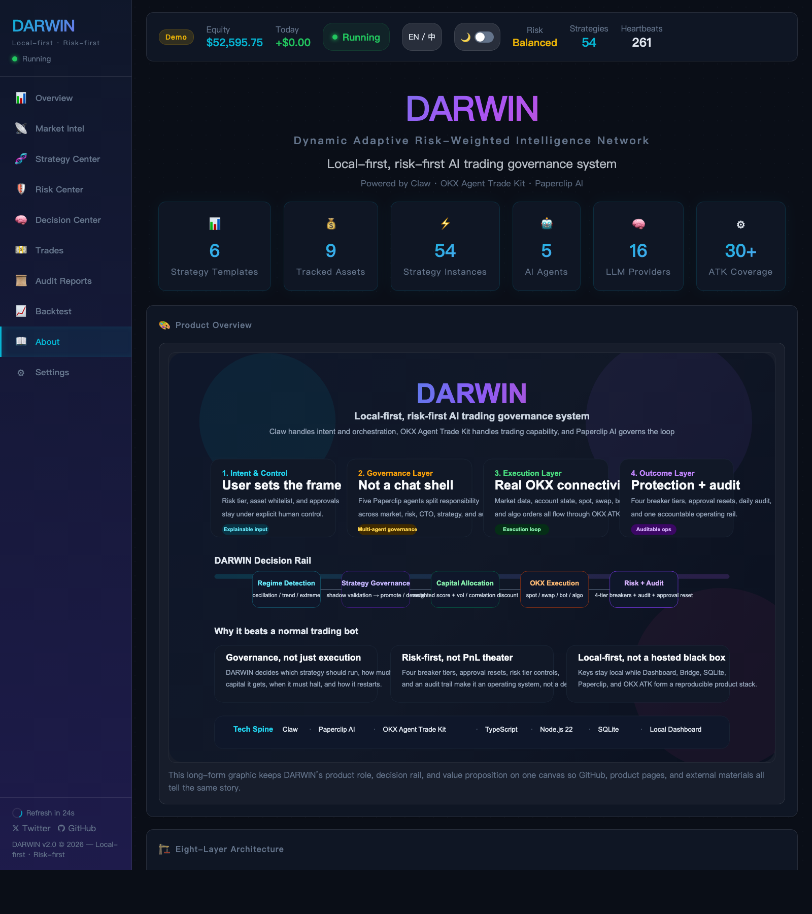
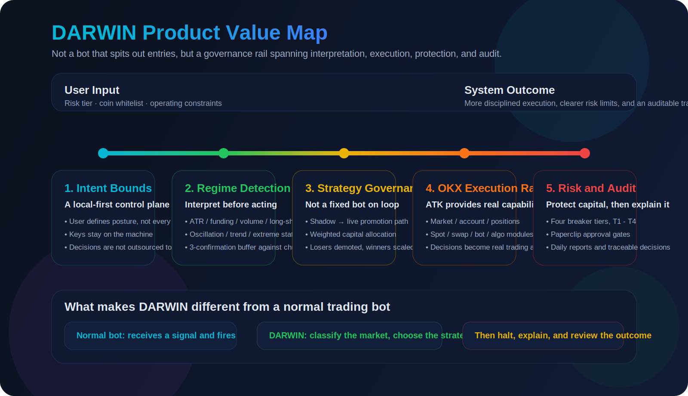
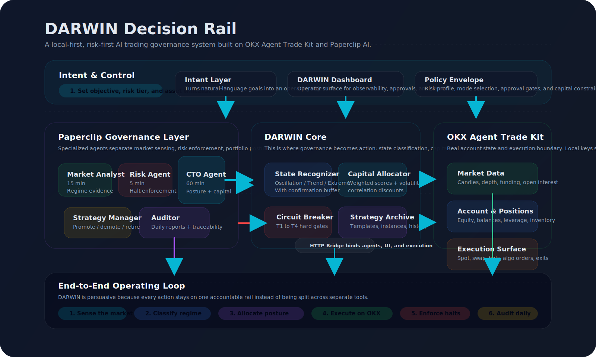
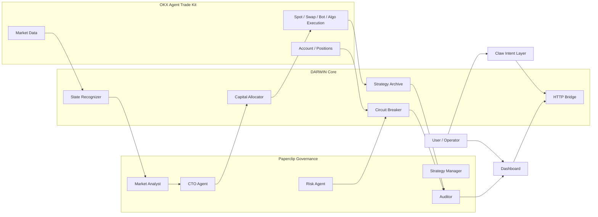

<p align="center">
  
  
  
  
  
</p>

<h1 align="center">DARWIN</h1>
<h3 align="center">Dynamic Adaptive Risk-Weighted Intelligence Network</h3>

<p align="center">
  <strong>DARWIN is a local-first, risk-first AI trading governance system powered by Claw, OKX Agent Trade Kit, and Paperclip AI.</strong><br/>
  It keeps market interpretation, strategy selection, live execution, risk halts, and reporting on one decision rail.
</p>

<p align="center">
  <a href="README.md">中文</a> | <strong>English</strong>
</p>

---

## What is DARWIN?

DARWIN is **not** a trading bot.

It is a **local-first, risk-first AI trading governance system** -- a self-governing, multi-agent system that reads the market, classifies its regime, dispatches the right strategy at the right time, executes through OKX, and keeps execution, halts, and reporting on the same decision rail.

Most trading bots do one thing: execute a fixed strategy. DARWIN does something fundamentally different:

- **It decides which strategy should run**, based on real-time market conditions
- **It lets strategies prove themselves** in shadow mode before risking real capital
- **It eliminates underperformers** and allocates more capital to winners
- **It governs itself** through a 5-agent organizational hierarchy with human approval gates
- **It never sleeps** -- heartbeat-driven agents monitor markets, risk, and performance 24/7

Two foundations make this possible:

| Foundation | Role |
|---|---|
| [**OKX Agent Trade Kit**](https://www.okx.com/zh-hans/agent-tradekit) | MCP + CLI covering the full trading lifecycle across market, account, spot, swap, bot, and related execution modules |
| [**Paperclip AI**](https://github.com/paperclipai/paperclip) | Open-source multi-agent orchestration with org hierarchy, scheduled heartbeats, budget control, and human approval gates |

**You set the risk profile and coin whitelist. DARWIN handles everything else.**

Project docs:
- [Product Positioning](docs/PRODUCT_POSITIONING.md)
- [Project Architecture](docs/PROJECT_ARCHITECTURE.md)
- [Full System Architecture](docs/ARCHITECTURE.md)
- [Strategy Specification](docs/STRATEGY_SPEC.md)

---

## Product Preview

English overview:



English about page:



---

## Why DARWIN Matters

- **It upgrades trading from execution to governance**: DARWIN does not just place orders; it selects strategy posture, limits exposure, enforces halts, and leaves an audit trail.
- **It keeps the full loop on one rail**: market interpretation, capital allocation, real execution, risk enforcement, and reporting stay connected instead of living in separate tools.
- **It turns OKX Agent Trade Kit into an operating system layer**: Claw interprets intent and orchestrates decisions, while OKX ATK provides real market data, account state, and execution capability.



---

## Architecture At A Glance





See [Project Architecture](docs/PROJECT_ARCHITECTURE.md) for the full rationale behind each layer.

---

## Architecture

```
╔═══════════════════════════════════════════════════════════════════╗
║  USER LAYER                                                       ║
║  Risk Tier  ·  Coin Whitelist  ·  Approval Resets  ·  Dashboard   ║
╚══════════════════════════╤════════════════════════════════════════╝
                           │  Approval gates (Paperclip UI)
╔══════════════════════════▼════════════════════════════════════════╗
║  PAPERCLIP AGENT ORGANIZATION  (http://127.0.0.1:3100)            ║
║                                                                    ║
║  ┌───────────────┐  ┌────────────────┐  ┌─────────────────────┐   ║
║  │   CTO Agent   │  │ Market Analyst │  │    Risk Agent       │   ║
║  │   (1h tick)   │  │  (15min tick)  │  │    (5min tick)      │   ║
║  │               │  │                │  │                     │   ║
║  │ State switch  │  │ ATR · Funding  │  │ 4-tier breaker      │   ║
║  │ Rebalance     │  │ Volume · L/S   │  │ Paperclip approval  │   ║
║  └───────┬───────┘  └───────┬────────┘  └────────┬────────────┘   ║
║  ┌───────▼──────────────────▼────────────────────▼────────────┐   ║
║  │  Strategy Manager (daily)  ·  Auditor (daily)              │   ║
║  │  Promote / Demote / Eliminate  ·  Immutable Audit Trail    │   ║
║  └────────────────────────────────────────────────────────────┘   ║
╚══════════════════════════╤════════════════════════════════════════╝
                           │  HTTP heartbeat calls
╔══════════════════════════▼════════════════════════════════════════╗
║  DARWIN HTTP BRIDGE  (http://127.0.0.1:3200)                      ║
║  POST /heartbeat/{market|risk|cto|strategy-manager|auditor}       ║
║  POST /approval/{tier3-reset|tier4-reset}                         ║
║  GET  /status · GET /dashboard                                    ║
╚═══════════╤══════════════╤═══════════════════╤════════════════════╝
            │              │                   │
╔═══════════▼════╗ ╔═══════▼═════════╗ ╔══════▼══════════════╗
║ MARKET INTEL   ║ ║  RISK ENGINE    ║ ║  STRATEGY ARCHIVE   ║
║ Oscillation    ║ ║ 4-Tier Breaker  ║ ║  6 strategies × N   ║
║ Trend          ║ ║ T1 Strategy     ║ ║  Shadow → Live      ║
║ Extreme        ║ ║ T2 Asset        ║ ║  Weighted allocator ║
║                ║ ║ T3 Portfolio    ║ ║                     ║
║ 3-confirmation ║ ║ T4 Emergency    ║ ║  Score = WR × 0.4   ║
║ buffer         ║ ║                 ║ ║        + SR × 0.3   ║
║                ║ ║ Human approval  ║ ║        + fit × 0.2  ║
║ ATR · Funding  ║ ║ at T3/T4       ║ ║        + stab × 0.1 ║
║ Volume · L/S   ║ ║                 ║ ║                     ║
╚═══════════╤════╝ ╚═════════════════╝ ╚══════╤═════════════╝
            │                                  │
╔═══════════▼══════════════════════════════════▼══════════════════╗
║  OKX AGENT TRADE KIT  (Demo or Live)                            ║
║                                                                  ║
║  Spot Grid · Contract Grid · Martingale · Trend Trailing         ║
║  Funding Arb · Extreme Defense · TWAP · Iceberg · Spot/Swap     ║
║                                                                  ║
║  MCP + CLI across the full trading lifecycle                     ║
╚══════════════════════════════════════════════════════════════════╝
```

---

## 6 Key Innovations

### 1. Market Regime Detection with Confirmation Buffer

Before any strategy fires, DARWIN classifies the market into one of three regimes using four independent indicators:

| Regime | ATR (vs avg) | Funding Rate | Volume | Long/Short Ratio |
|--------|:---:|:---:|:---:|:---:|
| **Oscillation** | < 1.2x | Near zero | Normal | Balanced |
| **Trend** | > 1.5x | Directional | Elevated | Skewed |
| **Extreme** | > 2.5x | Extreme | Very high | Panic / euphoria |

A **3-confirmation buffer** prevents whipsaws: a regime must persist for 3 consecutive heartbeats (45 minutes at default intervals) before DARWIN changes its posture. This eliminates false signals and ensures strategy transitions are deliberate, not reactive.

### 2. Multi-Agent Governance via Paperclip

DARWIN is not a monolithic bot. It is a **Paperclip company** with 5 specialized agents operating on independent heartbeat schedules:

```
CTO Agent (Chief Trading Officer)     1h tick     root, no manager
  |
  +-- Market Analyst                 15min tick   feeds regime state to CTO
  |
  +-- Risk Agent                      5min tick   circuit breaker, escalation
  |
  +-- Strategy Manager                  daily     promote / demote lifecycle
  |
  +-- Auditor                           daily     immutable audit trail + report
```

Each agent has a single responsibility. No agent can override another's domain. The CTO coordinates but cannot disable the Risk Agent's circuit breakers. This separation of concerns mirrors how real trading desks operate.

### 3. Four-Tier Circuit Breaker with Human Approval Gates

```
Tier 1 ──  Strategy drawdown exceeded      ──>  Pause strategy       ──>  Auto-recover next day
Tier 2 ──  Asset drawdown exceeded (x0.5)  ──>  Pause asset's bots   ──>  Risk + CTO review
Tier 3 ──  Portfolio drawdown exceeded     ──>  HALT all strategies   ──>  Paperclip approval required
Tier 4 ──  Daily loss 2x limit / API down  ──>  EMERGENCY STOP ALL   ──>  Manual restart only
```

Tiers 1-2 are automatic. **Tiers 3-4 require explicit human approval through Paperclip's UI** before the system can resume. This is not optional -- it is architecturally enforced. No code path can bypass it.

**Execution Gate:** Once a breaker activates, new trade entries are blocked and affected strategies are force-closed. The CTO agent also checks breaker state before activating any strategy.

### 4. Shadow-First Strategy Lifecycle

Every strategy must earn its place. No strategy touches real capital until it has proven itself:

```
YAML spec submitted
  --> Static validation (market states, tool whitelist, risk parameters)
  --> Shadow bot created on OKX demo account
  --> Performance tracked every heartbeat (win rate, drawdown, returns)
  --> Promotion criteria evaluated with tool-aware thresholds:
        Grid bots:  min 3 days, 3+ completed trades
        DCA bots:   min 3 days, 3+ completed trades
        Swap/Spot:  min 3 days, 1+ completed trade
  --> PROMOTED to live (capital allocated via weighted scoring)
  --> DEMOTED if live drawdown exceeds trigger threshold
  --> ELIMINATED after 3 failed shadow attempts (permanently archived)
```

This creates a disciplined lifecycle: only strategies that consistently perform under the current regime continue receiving capital.

### 5. Weighted Scoring Capital Allocation

Capital is not distributed equally. It is allocated scientifically:

```
Strategy Score  =  Win Rate    x 0.4
                +  Sharpe Proxy x 0.3
                +  State Match  x 0.2    (how well strategy fits current regime)
                +  Stability    x 0.1    (consistency of returns)

Allocation  =  Deployable Pool  x  (Score / Sum of All Scores)
```

Hard caps by risk tier prevent over-concentration:

| Risk Tier | Active Pool | Single Strategy Cap | New Strategy Cap |
|---|:---:|:---:|:---:|
| Conservative | 30% of equity | 20% of pool | 8% of pool |
| Balanced | 50% of equity | 30% of pool | 10% of pool |
| Aggressive | 70% of equity | 40% of pool | 15% of pool |

**Extreme regime override:** Regardless of tier, maximum 5% of equity is deployed during extreme market conditions.

### 6. Zero-Degradation LLM Enhancement

DARWIN supports **16 LLM providers** -- but needs **none of them** to operate:

```
Tier 1:  Anthropic (Claude)
Tier 2:  OpenAI, DeepSeek, Groq, Mistral, xAI (Grok), Moonshot,
         Zhipu (ChatGLM), Baichuan, Yi, Qwen, OpenRouter,
         Together AI, SiliconFlow
Tier 3:  Ollama (local, no API key needed)
Custom:  Any OpenAI-compatible endpoint
```

The key design principle: **all trading decisions are rule-based first**. LLMs only enrich the rationale, adjust priority hints, and add risk commentary. If every LLM provider fails simultaneously, DARWIN continues operating at full capacity with zero degradation. AI is an enhancement layer, never a dependency.

---

## 6 Official Strategies x N Coins

| # | Strategy | OKX Tool | Market Regime | Description |
|:---:|---|---|:---:|---|
| 001 | **Spot Grid** | `okx_grid_bot` | Oscillation | Automated buy-low-sell-high grid within price bands |
| 002 | **Contract Martingale** | `okx_dca_bot` | Oscillation | 5x leveraged DCA -- averages down on dips |
| 003 | **Extreme Defense Sentinel** | `okx_spot_order` | Extreme | Pure monitoring mode -- capital preservation only |
| 004 | **Contract Grid** | `okx_contract_grid` | Oscillation | 5x leveraged bilateral grid for amplified range profits |
| 005 | **Trend Trailing** | `okx_swap_trailing_stop` | Trend | MACD-triggered entry with 3% trailing take-profit |
| 007 | **Funding Rate Arbitrage** | `okx_funding_arb` | Osc + Trend | Delta-neutral: spot long + swap short, harvests funding |

Each strategy is a **coin-agnostic template** using wildcard asset declarations. With the default 9-coin whitelist (BTC, ETH, SOL, DOGE, XRP, TRX, HYPE, OKB, XAUT), this produces **54 concurrent strategy instances**, each independently tracked, scored, and managed.

> 💡 Note: HYPE-USDT-SWAP and OKB-USDT-SWAP do not exist on OKX. Contract strategies for these assets are automatically skipped.

**Additional execution engines (fully implemented):**
- `okx_twap` -- Time-Weighted Average Price order splitting for large positions
- `okx_iceberg` -- Hidden volume execution to minimize market impact

---

## Quick Start

### Prerequisites

- **Node.js 22+** with `pnpm`
- **OKX API key** (demo mode recommended for testing)
- **Paperclip AI**: `npm install -g paperclipai`

### 1. Install & Configure

```bash
git clone <repo>
cd DARWIN
pnpm install

cp .env.example .env
# Required: OKX_API_KEY, OKX_SECRET_KEY, OKX_PASSPHRASE
# Recommended: OKX_DEMO_MODE=true
# Optional: ASSETS=BTC-USDT,ETH-USDT,SOL-USDT,DOGE-USDT,XRP-USDT,TRX-USDT,HYPE-USDT,OKB-USDT,XAUT-USDT
# Optional: RISK_TIER=balanced (conservative|balanced|aggressive)
# Optional: Any LLM provider API key (enhances but not required)
```

### 2. Launch Paperclip (Agent Platform)

```bash
pnpm run paperclip
# Paperclip UI at http://localhost:3100
# DARWIN company + 5 agents auto-configured
```

### 3. Start DARWIN

```bash
pnpm start
# Loads 6 official strategies, expands to 54 instances
# Starts HTTP bridge on :3200
# Runs initial market scan across all whitelisted coins
# Activates heartbeat schedules (market/risk/CTO/strategy/audit)
```

### 4. Watch It Run

```
  ██████╗  █████╗ ██████╗ ██╗    ██╗██╗███╗   ██╗
  ██╔══██╗██╔══██╗██╔══██╗██║    ██║██║████╗  ██║
  ██║  ██║███████║██████╔╝██║ █╗ ██║██║██╔██╗ ██║
  ██║  ██║██╔══██║██╔══██╝██║███╗██║██║██║╚██╗██║
  ██████╔╝██║  ██║██║  ██║╚███╔███╔╝██║██║ ╚████║
  ╚═════╝ ╚═╝  ╚═╝╚═╝  ╚═╝ ╚══╝╚══╝ ╚═╝╚═╝  ╚═══╝

  Mode         DEMO
  Risk Tier    BALANCED
  Assets       BTC-USDT  ETH-USDT  SOL-USDT  DOGE-USDT  XRP-USDT  TRX-USDT  HYPE-USDT  OKB-USDT  XAUT-USDT
  Heartbeat    15 min

  Paperclip bridge ready -> http://127.0.0.1:3200

  BTC-USDT    ~ Oscillation    [========----]  81%
                Vol 0.87x  Funding +0.0042%  Volume 1.13x  L/S 1.02

  ETH-USDT    ~ Oscillation    [======------]  68%
                Vol 0.91x  Funding +0.0031%  Volume 1.08x  L/S 0.98

  Strategy Instances
  +----------------------------+------------+----------+------------------+
  | Name                       | Type       | Status   | Bot ID           |
  +----------------------------+------------+----------+------------------+
  | Spot Grid - BTC            | Spot Grid  | Shadow   | ...226132901888  |
  | Spot Grid - ETH            | Spot Grid  | Shadow   | ...263512535040  |
  | Contract Martingale - BTC  | Martingale | Shadow   | ------------     |
  +----------------------------+------------+----------+------------------+

  Risk Agent    Equity $52,270  Daily P&L +$0.00  Drawdown 0.00%
```

### 5. Demo Scenarios

```bash
pnpm run verify       # Fastest project verification path
pnpm run demo:guided  # Guided end-to-end demo

pnpm run demo:a    # Scenario A: Normal full-system operation
pnpm run demo:b    # Scenario B: Market regime transition (oscillation -> trend)
pnpm run demo:c    # Scenario C: Circuit breaker cascade + Paperclip approval
```

### 6. Backtesting

```bash
pnpm run backtest          # Default 30-day historical simulation
pnpm run backtest:90d      # 90-day backtest
pnpm run backtest:180d     # 180-day backtest
```

### 7. Dashboard (Real-time Control Panel)

```bash
pnpm run bridge
# → Dashboard available at http://localhost:3200
```

Open `http://localhost:3200` in your browser to access the real-time dashboard:

| Page | Features |
|------|----------|
| **Overview** | Equity summary, capital allocation, strategy pipeline, positions, market status, system health |
| **Market Intel** | 9-coin live status, ATR/funding/long-short ratio indicators, state history |
| **Strategy Center** | Strategy leaderboard, score breakdown, active bots, state heatmap |
| **Risk Center** | 4-tier circuit breaker status, position monitoring, risk event log |
| **AI Decisions** | 5-agent real-time collaboration, decision pipeline, market judgment, capital allocation |
| **Trade Log** | Cumulative P&L, Sharpe ratio, position details, daily P&L charts |
| **Audit Reports** | AI-generated daily reports, strategy category analysis, CSV export |
| **Backtest Engine** | 3-tier risk comparison, equity curve, drawdown analysis, market state timeline |
| **About** | Architecture diagram, system advantages, module notes, security architecture |
| **Settings** | Risk tier adjustment, manual circuit breaker reset, config persistence |

> Supports dark/light theme toggle with full mobile responsiveness (375px+)
> Language support: use the top-right language toggle, or open `http://localhost:3200/dashboard?lang=cn` / `http://localhost:3200/dashboard?lang=en`

---

## Execution Engine Coverage

DARWIN integrates **8 distinct execution tools** through the OKX Agent Trade Kit:

| Tool | Engine | Description |
|---|---|---|
| `okx_grid_bot` | Spot Grid | Automated buy-low-sell-high within configurable price bands |
| `okx_contract_grid` | Contract Grid | Leveraged bilateral grid for amplified range-bound profits |
| `okx_dca_bot` | Martingale / DCA | Cost-averaging on dips with configurable leverage |
| `okx_swap_trailing_stop` | Trend Trailing | Perpetual swap entry with trailing stop-loss/take-profit |
| `okx_spot_order` | Spot Orders | Market and limit orders with algo TP/SL |
| `okx_funding_arb` | Funding Arbitrage | Delta-neutral: long spot + short swap, harvests funding rate |
| `okx_twap` | TWAP | Time-weighted order splitting for minimal market impact |
| `okx_iceberg` | Iceberg | Hidden volume execution for large positions |

---

## Validation

For the shortest proof path, run:

```bash
pnpm run verify
pnpm run demo:guided
```

Current verified status as of 2026-03-20:

- `pnpm build` passes
- `pnpm test:strategies` passes with `6 passed / 0 failed / 0 skipped`

## Tech Stack

| Layer | Technology | Details |
|---|---|---|
| Agent Orchestration | [Paperclip AI](https://github.com/paperclipai/paperclip) | 5 agents, org hierarchy, heartbeat scheduling, approval gates |
| Trading Platform | [OKX Agent Trade Kit](https://www.okx.com/zh-hans/agent-tradekit) | MCP + CLI covering market, account, execution, and bot workflows |
| LLM Enhancement | 16 providers supported | Claude, GPT, DeepSeek, Groq, Grok, Ollama, and 10 more (all optional) |
| HTTP Bridge | Node.js built-in `http` | Port 3200, zero-dependency bridge between DARWIN and Paperclip |
| Database | SQLite (Node.js 22 built-in) | Strategy archive, performance history, audit trail -- no external DB |
| Language | TypeScript 5.x | Strict mode, ESM modules |
| Runtime | Node.js 22+ | `--experimental-sqlite` for zero-dependency persistence |
| Package Manager | pnpm | |
| Dashboard | Single-file SPA | `dashboard.html` -- no build step, no framework, just open in browser |

**Total external dependencies: 4** (`axios`, `dotenv`, `js-yaml`, `node-cron`). Everything else is built-in.

---

## Security

| Principle | Implementation |
|---|---|
| **API keys never leave the machine** | OKX credentials stored in `.env`, never transmitted to any external service |
| **Zero shell injection surface** | ATK CLI wrapper uses `execFileSync` with argument arrays -- no string interpolation |
| **Strategy sandboxing** | All strategy YAML must pass static validation against a 27-tool whitelist before execution |
| **Separation of powers** | Circuit breakers are Risk Agent-exclusive -- strategies cannot disable or override them |
| **Human approval gates** | Tier 3/4 circuit breaker resets require explicit approval through Paperclip UI |
| **Network isolation** | HTTP bridge binds to `127.0.0.1` only -- never exposed to external networks |
| **Immutable audit trail** | Every decision, trade, and state change recorded in SQLite with timestamps |
| **Demo-first by default** | `OKX_DEMO_MODE=true` is the default -- real trading requires explicit opt-in |

---

## Project Structure

```
DARWIN/
 |-- src/
 |    |-- index.ts                        Main entry -- 5 agent heartbeat loops
 |    |-- config.ts                       .env config (assets, risk tier, LLM keys)
 |    |-- db.ts                           SQLite via Node 22 built-in
 |    |-- market/
 |    |    |-- state-recognizer.ts        3-state regime detection + confirmation buffer
 |    |    +-- indicators.ts              ATR, RSI, MACD, Bollinger Bands, etc.
 |    |-- risk/
 |    |    +-- circuit-breaker.ts         4-tier circuit breaker + Paperclip approval
 |    |-- strategy/
 |    |    |-- archive.ts                 Strategy registry + leaderboard scoring
 |    |    |-- loader.ts                  YAML -> DB + wildcard coin expansion
 |    |    +-- validator.ts               27-tool whitelist, tool-aware thresholds
 |    |-- shadow/
 |    |    +-- runner.ts                  Shadow bot lifecycle + dead bot recovery
 |    |-- execution/
 |    |    |-- manager.ts                 SL/TP/max-hold enforcement + execution gate
 |    |    |-- arb-funding.ts             Funding rate arbitrage engine
 |    |    |-- recurring-buy.ts           Recurring buy execution
 |    |    +-- twap.ts                    TWAP + Iceberg execution
 |    |-- cto/
 |    |    |-- agent.ts                   CTO heartbeat + state transitions
 |    |    |-- allocator.ts               Weighted scoring capital allocation
 |    |    +-- llm.ts                     Optional LLM enrichment (16 providers)
 |    |-- atk/
 |    |    |-- runner.ts                  Safe ATK CLI wrapper (no shell injection)
 |    |    |-- bot.ts                     Grid bot CRUD
 |    |    |-- dca.ts                     DCA / Martingale bot CRUD
 |    |    |-- swap.ts                    Perpetual swap + trailing stop
 |    |    |-- spot.ts                    Spot orders + algo TP/SL
 |    |    |-- account.ts                 Portfolio equity reader
 |    |    +-- client.ts                  Market data client
 |    |-- report/
 |    |    +-- generator.ts              Daily performance report
 |    |-- backtest/
 |    |    +-- engine.ts                  Historical simulation (30/90/180 day)
 |    |-- demo/
 |    |    +-- scenarios.ts              3 demo scenarios (A/B/C)
 |    +-- paperclip/
 |         |-- server.ts                 HTTP bridge (:3200)
 |         +-- client.ts                 Paperclip REST client
 |-- strategies/
 |    +-- official/
 |         |-- 001-spot-grid.yaml
 |         |-- 002-contract-martingale.yaml
 |         |-- 003-extreme-defense.yaml
 |         |-- 004-contract-grid.yaml
 |         |-- 005-trend-trailing.yaml
 |         +-- 007-funding-arb.yaml
 |-- dashboard.html                      Single-file SPA dashboard
 |-- .env.example
 +-- package.json
```

---

## What Makes DARWIN Distinct

This is not another trading bot with a ChatGPT wrapper. Here is what sets DARWIN apart:

| Dimension | Typical Trading Bot | DARWIN |
|---|---|---|
| **Decision making** | Single fixed strategy | Multi-agent governance with 5 specialized agents |
| **Strategy lifecycle** | Deploy and pray | Shadow-first lifecycle governance |
| **Market adaptation** | Manual parameter tuning | Automatic regime detection with 3-confirmation buffer |
| **Risk management** | Stop-loss and hope | 4-tier circuit breaker with human approval gates |
| **Capital allocation** | Equal split or manual | Weighted scoring with volatility adjustments |
| **OKX ATK usage** | 1-2 tools | 9 execution engines across the full ATK surface |
| **AI dependency** | Breaks without LLM | Zero degradation -- AI enriches, rules decide |
| **Scalability** | One coin, one strategy | 6 strategies x 9 coins = 54 concurrent instances |
| **Transparency** | Black box | Immutable audit trail, daily reports, single-file dashboard |
| **Human control** | None or all-or-nothing | Graduated: auto-recovery at T1, human approval at T3/T4 |

### Product Characteristics

**Full OKX ATK Depth** -- DARWIN does not just call one or two OKX tools. It uses OKX Agent Trade Kit across market data, account state, spot and swap execution, bots, and algorithmic orders through one unified strategy layer.

**Genuine Multi-Agent Architecture** -- Not a single script pretending to be agents. DARWIN runs as a registered Paperclip company with 5 independently scheduled agents, each with distinct responsibilities, heartbeat intervals, and escalation paths. The organizational hierarchy is real and enforced.

**Shadow-First Lifecycle Governance Is the Core Feature** -- Strategies are not static configurations. They pass through validation, shadow observation, promotion, demotion, and elimination. Capital goes to strategies that prove themselves under the current market regime.

**Human-in-the-Loop Where It Matters** -- Full automation for routine operations. Mandatory human approval for high-severity events (portfolio-level circuit breakers, emergency stops). This is the right balance: autonomous enough to be useful, controlled enough to be safe.

**Self-Healing Runtime** -- Dead bots are automatically detected and restarted with a 30-minute cooldown. Daily PnL resets at day boundaries. SQLite WAL mode prevents database locking under concurrent access. Strategy specs are hot-reloaded when YAML versions change. The system recovers from crashes without manual intervention.

**Zero External Dependencies** -- SQLite is built into Node.js 22. The HTTP bridge uses Node's built-in `http` module. The entire system runs on 4 npm packages. No Redis, no Postgres, no Docker, no Kubernetes. Clone, configure, run.

---

<p align="center">
  <br/>
  <strong>DARWIN</strong><br/>
  <em>Local-first, risk-first AI trading governance system.</em>
  <br/><br/>
</p>
