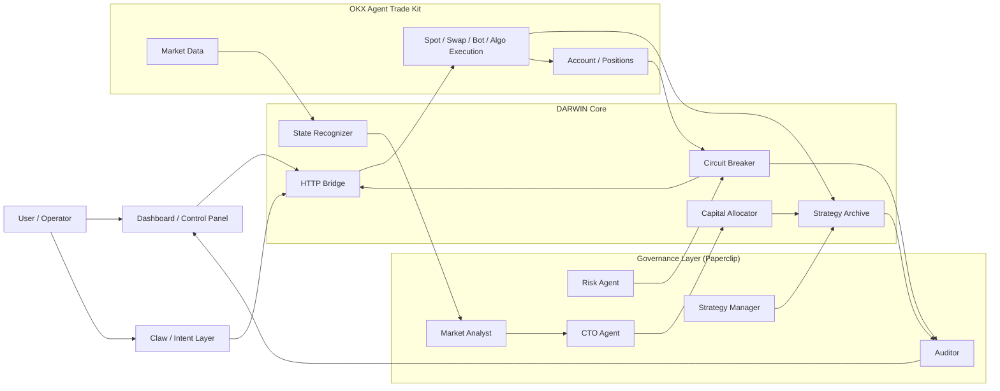

# DARWIN Project Architecture

DARWIN is a local-first, risk-first AI trading governance system powered by Claw, OKX Agent Trade Kit, and Paperclip AI.

Its value comes from unifying five things that are usually fragmented:

1. Market interpretation
2. Strategy selection
3. Real execution
4. Risk enforcement
5. Audit and reporting

## Product Value

DARWIN is persuasive as a product because it solves three practical problems at once:

1. It reduces operator overload by converting one high-level objective into a managed trading loop.
2. It makes strategy selection state-aware instead of leaving one strategy running blindly.
3. It keeps execution, risk, and reporting connected, so every action can be explained after the fact.

## Why This Architecture Exists

Most trading systems break at the boundaries:

- market analysis and execution live in different tools
- risk logic is bolted on after the fact
- portfolio state is hard to explain after a decision is made
- operators can see orders, but not the reasoning chain behind them

DARWIN solves that by keeping the full decision rail connected from regime detection to reporting.

## System Diagram

## Layer Responsibilities

### 1. Intent and Operator Layer

- `Claw` accepts natural-language goals and operating intent.
- The operator defines risk tier, asset whitelist, and reset authority.
- The dashboard is the observability and control surface.

This layer decides what the system is allowed to pursue, but not how a trade is executed internally.

### 2. Governance Layer

Paperclip provides the multi-agent operating model:

- `Market Analyst` publishes market regime observations
- `Risk Agent` enforces halts and drawdown rules
- `CTO Agent` adjusts strategy posture and deployment
- `Strategy Manager` promotes or demotes strategies
- `Auditor` produces daily summaries and traceability

This is what turns DARWIN from a bot into an operating system for trading decisions.

### 3. DARWIN Core

DARWIN itself owns the internal decision logic:

- `State Recognizer` classifies oscillation, trend, and extreme conditions
- `Strategy Archive` stores templates, instances, and performance history
- `Capital Allocator` decides how much capital each strategy should receive
- `Circuit Breaker` enforces four-tier risk halts
- `HTTP Bridge` binds the dashboard, agents, and execution layer together

This core is where strategy governance happens.

### 4. Execution Layer

The execution boundary is the OKX Agent Trade Kit.

DARWIN relies on OKX ATK for:

- market and funding data
- account state and positions
- spot orders
- swap orders and leverage changes
- grid bots, DCA bots, TWAP, iceberg, trailing stop, and related execution tools

This separation matters because it keeps execution real while preserving local control and traceability.

## Decision Flow

The normal operating loop is:

1. Read market state and account state
2. Classify regime and confidence
3. Choose the best strategy mix for the current environment
4. Execute through OKX Agent Trade Kit
5. Continuously evaluate drawdown and risk state
6. Halt or recover when thresholds are crossed
7. Persist results into reports and history

In short:

`market -> strategy -> execution -> risk -> report`

## Why This Is Persuasive

DARWIN is stronger than a typical trading bot for three reasons:

### Risk is first-class

Risk logic is not an afterthought. The circuit breaker sits alongside execution, not behind it.

### Strategy is state-aware

DARWIN does not assume one strategy should run forever. It selects posture based on market conditions.

### The system is explainable

The same architecture that makes decisions also records the evidence chain behind those decisions.

## What To Show In Product Demos

If someone wants to understand the system quickly, show these surfaces in order:

1. Dashboard overview
2. Market intelligence
3. Strategy center
4. Risk center
5. Audit reports

That sequence maps directly to the architecture above and makes the product easier to trust.
